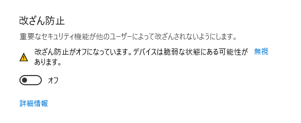

# SetupPwsh

This repository is a collection of scripts for changing Windows10 settings.

These are for program development and experiment use only.

## Tamper Protection

!! Constant use is not recommended. !!

Disable Tamper Protection to run scripts.

## Scripts

Scripts are written for each configuration or category.

- [x] Disable Firewall
- [x] Disable Windows Defender Realtime Protection
- [x] Display file extentions and hidden files
- [x] Disable SmartScreen
- [x] Disable Windows Update
  - [x] Disable Windows Update Schedule
- [x] Disable Update and Shutdown
- [x] Disable EdgeSwipe
- [x] Disable HelpHint
- [ ] Set HighPerformance mode
- [x] Disable request password login when wake up from sleep mode
- [x] Allow login without password
- [ ] Disable Notification
  - [ ] Toast
  - [ ] Screen Mirroring
  - [ ] Balloon
  - [ ] Hint to use and recommendation
- [ ] Disable system sound
- [x] Disable Automatic Window Arrangement
- [x] Set the desktop background to #000000
- [x] Hide Trash on the desktop
